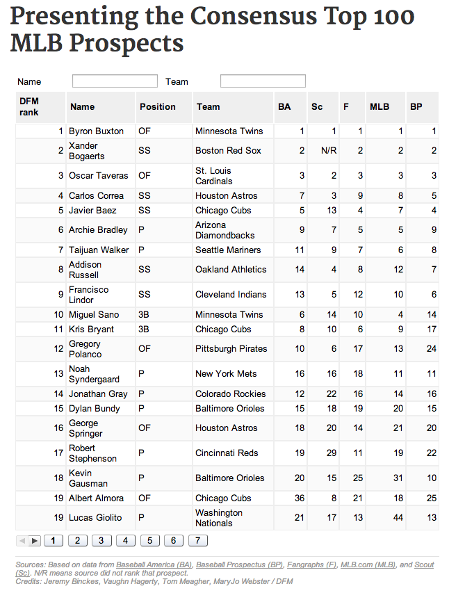

mlb-prospects-table
===================

What is this?
-------------

Data table of the best 2014 MLB prospects.

Demo: http://dfm.ydr.com/article/presenting-the-consensus-top-100-mlb-prospects/dffe18ebb434bfc8059f5a79dd499f4a

Credits
---------

Vaughn Hagerty, Jeremy Binckes, Tom Meagher, MaryJo Webster

Assumptions
-----------

* Google visualization API

What's in here?
---------------

The project contains the following folders and important files:

* ``index.html`` -- The app html
* ``lib/js`` -- Javascript
* ``lib/css`` -- Strangely enough, stylesheets

License
----------

This code is available under the MIT license. For more information, please see the LICENSE file in this repo.

